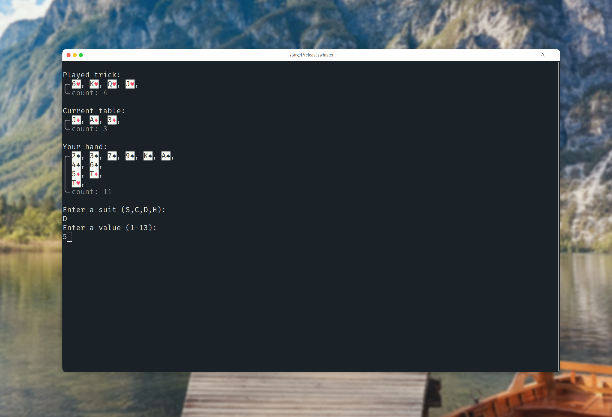

# Whister
This is a terminal-based card game written in Rust!

## The Goal
This project _aims_ to create a _full Colour Whist game_ with multiple levels of AI to play against.
A multiplayer version would be a cool addition too!

## The Current Status
The game has been implemented for single-player mode (no teams because there is no voting round yet).
For this mode, an AI has been trained using *Approximate Reinforcement Learning*.
This trained AI model is supplied as a `.bin` file in the `data/` directory.

## License
This module is licensed under version 3 of the GNU General Public License.
